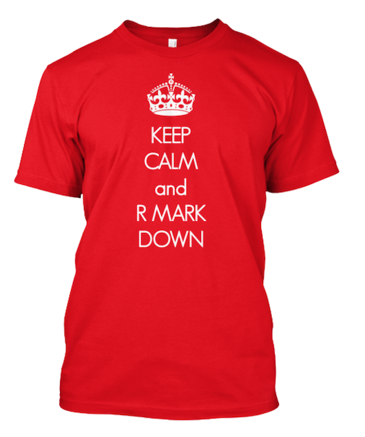

## Today

No class on Thursday

Gathering data from APIs 

Assignment 1 

Rmarkdown (if time permits)


## API

API = **A**pplication **P**rogram **I**nterface

Many data sources have API's - largely for talking to other web interfaces

Consists of a set of methods to search, retrieve, or submit data to, a data source

We can write R code to interface with an API (lot's require authentication though)

Many packages already connect to well-known API's (we'll look at a couple today)

## `twitteR`

`twitteR` is an R package which provides access to the Twitter API

`streamR` provides access to Twitters streaming API

Create an app [here](https://apps.twitter.com/) 

```{r, eval = FALSE}
library("twitteR")
consumer_key = 'your key'
consumer_secret = 'your secret'
access_token = 'your access token'
access_secret = 'your access secret'

setup_twitter_oauth(consumer_key,
                    consumer_secret,
                    access_token,
                    access_secret)

searchTwitter("#dkpol", n=500)
```

## NYT API

`rtimes` is a collection of functions to search and acquire data from various New York Times APIs.

Register for your own API keys [here](http://developer.nytimes.com/apps/register)

```{r, eval = FALSE}
library("rtimes")
out = as_search(q = "bailout", 
                begin_date = "20081001", 
                end_date = '20081201',
                 key = "XXX")
out$data[1:2]
```

## Statistics Denmark API

This R package connects to the StatBank API from Statistics Denmark.

```{r, eval = FALSE}
library("devtools")
install_github("rOpenGov/dkstat")
```

Let's you programatically work with Statistics Denmark data 

## 

```{r}
library("dkstat")
dst_search(string = "bnp", field = "text")
```

## 

```{r}
aulaar = dst_get_data(table = "AULAAR", KØN = "Total", 
                       PERPCT = "Per cent of the labour force", 
                       Tid = 2013,
                       lang = "en")
aulaar
```

## Exercise 

Practice using the three packages

- grab the latest 300 posts on Twitter that use the "#rstats" hashtag
- query the NYT API for posts about "Denmark"
- download the "FV15TOT" table from Statistics Denmark

Go to [this page](https://github.com/ropensci/webservices) and check out what's currently available in R. Play with one of the listed packages. 

# Assignment 1

## General comments

Solutions now posted on the course page

Overall I think you did very well

Most of you were very creative in coming up with solutions - keep up the good work

A few groups had minor things so need to resubmit your code

## Improvements

Continue learning `dplyr` - it's worth it

I recommend using `ggplot2` for all your plotting - including maps

Use line graps for plotting a variable over time 

## Read data

```{r, message = FALSE, warning = FALSE}
library("readr")
df = read_csv("https://raw.githubusercontent.com/MuseumofModernArt/collection/master/Artworks.csv")
```

## Question 1 

**Question 1**: Create a new dataframe of the stock of paintings at MOMA for each month in the year

```{r, message = FALSE, warning = FALSE}
library("dplyr"); library("lubridate"); library("zoo")

df.q1 = df %>% 
  mutate(
    year = year(DateAcquired),
    month = month(DateAcquired),
    date = ymd(paste(year, month, "01",sep = "-"))
  ) %>% 
  group_by(date) %>% 
  summarise(
    supply = n()
  ) %>% 
  arrange(date) %>% 
  mutate(
    stock = cumsum(supply)
  )
head(df.q1)
```

## Question 2 

**Question 2**: Use `ggplot2` and your new data frame to plot the the stock of paintings on the y-axis and the date on the x-axis

```{r, result="hide", message = FALSE, warning = FALSE, fig.height = 6, fig.width=8}
library("zoo"); library("ggplot2"); library("ggthemes"); library("scales"); library("viridis")

p = ggplot(df.q1, aes(x = date, y = stock))
p = p + geom_line(colour = "red", size = 1) +
  theme_tufte() +
  theme(axis.title = element_text(), 
        axis.title.y = element_text(angle = 90)) + 
  labs("stock of paintings", title = "Question 2", x = NULL) + 
  scale_y_continuous(labels=comma) 
```

## 

```{r, echo = FALSE, message = FALSE, warning = FALSE, fig.height = 6, fig.width=8}

p = ggplot(df.q1, aes(x = date, y = stock))
p + geom_line(colour = "red", size = 1) +
  theme_tufte() +
  theme(axis.title = element_text(), 
        axis.title.y = element_text(angle = 90)) + 
  labs("stock of paintings", title = "Question 2", x = NULL) + 
  scale_y_continuous(labels=comma) 
```

## Question 3 

**Question 3**: Create the same plot but this time the color should reflect the stock of paintings for curator approved and non-curator approved paintings, respectively

```{r, message = FALSE, warning = FALSE, fig.height = 6, fig.width=8}
df.q3 = df %>% 
  mutate(
    year = year(DateAcquired),
    month = month(DateAcquired),
    date = ymd(paste(year, month, "01",sep = "-"))
  ) %>% 
  group_by(date, CuratorApproved) %>% 
  summarise(
    supply = n()
  ) %>% 
  ungroup() %>% 
  group_by(CuratorApproved) %>% 
  arrange(CuratorApproved, date) %>% 
  mutate(
    stock = cumsum(supply)
  )
head(df.q3)
```

## 

```{r, results = "hide", message = FALSE, warning = FALSE, fig.height = 6, fig.width=8}
p = ggplot(df.q3, aes(x = date, y = stock, colour = CuratorApproved))
p = p + geom_line(size = 1) +
  theme_tufte()  +
  theme(axis.title = element_text(), 
        axis.title.y = element_text(angle = 90)) + 
  labs("stock of paintings", title = "Question 3", x = NULL) + 
  scale_y_continuous(labels=comma) +
  scale_color_viridis(discrete = TRUE)
```

## 

```{r, echo = FALSE, message = FALSE, warning = FALSE, fig.height = 6, fig.width=8}
p = ggplot(df.q3, aes(x = date, y = stock, colour = CuratorApproved))
p + geom_line(size = 1) +
  theme_tufte()  +
  theme(axis.title = element_text(), 
        axis.title.y = element_text(angle = 90)) + 
  labs("stock of paintings", title = "Question 3", x = NULL) + 
  scale_y_continuous(labels=comma) +
  scale_color_viridis(discrete = TRUE)
```

## Question 4

**Question 4**: Create a new data frame of the stock of paintings grouped by what department the painting belongs to

```{r, message = FALSE, warning = FALSE, fig.height = 6, fig.width=8}
df.q4 = df %>% 
  mutate(
    year = year(DateAcquired),
    month = month(DateAcquired),
    date = ymd(paste(year, month, "01",sep = "-"))
  ) %>% 
  group_by(date, Department) %>% 
  summarise(
    supply = n()
  ) %>% 
  ungroup() %>% 
  group_by(Department) %>% 
  arrange(Department, date) %>% 
  mutate(
    stock = cumsum(supply)
  )
head(df.q4)
```

## Question 5

**Question 5**: Plot this data frame using `ggplot2`. Which department has had the highest increase in their stock of paintings?

```{r, results = "hide", message = FALSE, warning = FALSE, fig.height = 6, fig.width=8}
p = ggplot(df.q4, aes(x = date, y = stock, colour = Department))
p = p + geom_line(size = 1) +
  theme_tufte() +
  theme(axis.title = element_text(), 
        axis.title.y = element_text(angle = 90)) + 
  labs("stock of paintings", title = "Question 5", x = NULL) + 
  scale_y_continuous(labels=comma) +
  scale_color_viridis(discrete = TRUE)
```

## 

```{r, echo = FALSE, message = FALSE, warning = FALSE, fig.height = 6, fig.width=8}
p = ggplot(df.q4, aes(x = date, y = stock, colour = Department))
p + geom_line(size = 1) +
  theme_tufte() +
  theme(axis.title = element_text(), 
        axis.title.y = element_text(angle = 90)) + 
  labs("stock of paintings", title = "Question 5", x = NULL) + 
  scale_y_continuous(labels=comma) +
  scale_color_viridis(discrete = TRUE)
```


##

```{r, results = "hide", message = FALSE, warning = FALSE, fig.height = 6, fig.width=8}
p = ggplot(df.q4, aes(x = date, y = stock, colour = Department))
p = p + geom_line(size = 1) +
  theme_tufte() +
  theme(axis.title = element_text(), 
        axis.title.y = element_text(angle = 90)) + 
  labs("stock of paintings", title = "Question 5", x = NULL) + 
  scale_y_log10() +
  scale_color_viridis(discrete = TRUE)
```

##

```{r, echo = FALSE, message = FALSE, warning = FALSE, fig.height = 6, fig.width=8}
p = ggplot(df.q4, aes(x = date, y = stock, colour = Department))
p + geom_line(size = 1) +
  theme_tufte() +
  theme(axis.title = element_text(), 
        axis.title.y = element_text(angle = 90)) + 
  labs("stock of paintings", title = "Question 5", x = NULL) + 
  scale_y_log10() +
  scale_color_viridis(discrete = TRUE)
```

## Alternative 

```{r, message = FALSE, warning = FALSE, fig.height = 6, fig.width=8}
df.q4.alt = df %>% 
  group_by(Department) %>% 
  summarise(
    stock = n()
  ) 
head(df.q4.alt)
```

## 

```{r, results = "hide", message = FALSE, warning = FALSE, fig.height = 6, fig.width=8}
p = ggplot(df.q4.alt, aes(x = Department, y = stock, fill = Department))
p = p + geom_bar(stat="identity") +
  theme_tufte() + 
  scale_y_continuous(labels=comma) +
  theme(axis.text.x = element_blank(),
        legend.position = "none") + 
  facet_wrap(~ Department, scales = "free_x") +
  scale_fill_viridis(discrete = TRUE)
```  

## 

```{r, echo = FALSE, message = FALSE, warning = FALSE, fig.height = 6, fig.width=8}
p = ggplot(df.q4.alt, aes(x = Department, y = stock, fill = Department))
p + geom_bar(stat="identity") +
  theme_tufte() + 
  scale_y_continuous(labels=comma) +
  theme(axis.text.x = element_blank(),
        legend.position = "none") + 
  facet_wrap(~ Department, scales = "free_x") +
  scale_fill_viridis(discrete = TRUE)
```  


## Question 6

**Question 6**: Write a piece of code that counts the number of paintings by each artist in the data set. List the 10 painters with the highest number of paintings in MOMA's collection.

```{r, message = FALSE, warning = FALSE, fig.height = 6, fig.width=8}
df.artist = df %>% 
  filter(Artist != "") %>% 
  group_by(Artist) %>% 
  summarise(count = n()) %>% 
  arrange(-count)

head(df.artist, 10)
```

## Question 7

**Question 7**: The variable `ArtistBio` lists the birth place of each painter. Use this information to create a world map where each country is colored according to the stock of paintings in MOMA's collection.

```{r, message = FALSE, warning = FALSE, fig.height = 6, fig.width=8}
library("stringr")
df$Nationality = str_extract(df$ArtistBio, "[A-Z][a-z]+")

df.nationality = df %>% 
  group_by(Nationality) %>% 
  summarise(count = n())

head(df.nationality)
```

## 

Information on country and country adjective available [here](https://www.englishclub.com/vocabulary/world-countries-nationality.htm)

Scrape and create data frame

```{r, message = FALSE, warning = FALSE, fig.height = 6, fig.width=8}
library("rvest")
link = "https://www.englishclub.com/vocabulary/world-countries-nationality.htm"
css.selector = "td:nth-child(2) , td:nth-child(1)"

country = link %>% 
  read_html() %>% 
  html_nodes(css = "td:nth-child(1)") %>% 
  html_text()

adjective = link %>% 
  read_html() %>% 
  html_nodes(css = "td:nth-child(2)") %>% 
  html_text()
```

##

```{r, message = FALSE, warning = FALSE, fig.height = 6, fig.width=8}
df.info = data.frame(country = country, adjective = adjective)
df.info$adjective = tolower(df.info$adjective)

df.info$adjective = ifelse(df.info$country == "United States of America (USA)",
                           "american", df.info$adjective)

head(df.info)
```

##

```{r, message = FALSE, warning = FALSE, fig.height = 6, fig.width=8}
df.nationality$Nationality = tolower(df.nationality$Nationality)

df.map = inner_join(df.nationality, df.info, by = c("Nationality" = "adjective"))

library("ggmap")
world.map = map_data("world")

library("countrycode")
world.map$iso2c = countrycode(world.map$region, 
                           origin = "country.name", 
                           destination = "iso2c")

df.map$iso2c = countrycode(df.map$country, 
                                 origin = "country.name", 
                                 destination = "iso2c")

df.map = inner_join(world.map, df.map, by = "iso2c")
```

## 

```{r, results = "hide", message = FALSE, warning = FALSE, fig.height = 6, fig.width=8}
p = ggplot(df.map, aes(x = long, y = lat, group = group, fill = count)) 
p = p + geom_polygon(colour = "black") +
  theme_tufte() +
  labs(title = "Painters by country") +
  scale_fill_viridis()
```

## 

```{r, results = "hide", message = FALSE, warning = FALSE, fig.height = 6, fig.width=8}
p = ggplot(df.map, aes(x = long, y = lat, group = group, fill = count)) 
p = p + geom_polygon(colour = "black") +
  theme_tufte() +
  labs(title = "Painters by country") +
  scale_fill_viridis(trans = "log", breaks = c(20, 8000), 
                     labels = c("low", "high"),
                     name = "count\n(log transformed)")
```

## 
```{r, echo = FALSE, message = FALSE, warning = FALSE, fig.height = 6, fig.width=8}
p = ggplot(df.map, aes(x = long, y = lat, group = group, fill = count)) 
p + geom_polygon(colour = "black") +
  theme_tufte() +
  labs(title = "Painters by country") +
  scale_fill_viridis()
```

## 

```{r, echo = FALSE, message = FALSE, warning = FALSE, fig.height = 6, fig.width=8}
p = ggplot(df.map, aes(x = long, y = lat, group = group, fill = count)) 
p + geom_polygon(colour = "black") +
  theme_tufte() +
  labs(title = "Painters by country") +
  scale_fill_viridis(trans = "log", breaks = c(20, 8000), 
                     labels = c("low", "high"),
                     name = "count\n(log transformed)")
```

## Question 8


**Question 8**: The `Dimensions` variable lists the dimensions of each painting. Use your data manipulation skills to calculate the area of each painting (in cm's). Create a data frame of the five largest and five smallest paintings in MOMA's collection.

## 

```{r, message = FALSE, warning = FALSE, fig.height = 6, fig.width=8}
dim = str_extract(df$Dimensions, "\\([^()]+\\)")
dim = gsub("\\(|\\)", "", dim)
dim = gsub("[a-z]", "", dim)
dim = str_trim(dim)
dim = str_split(dim, "  ")
df$width = unlist(lapply(dim, function(x) x[1]))
df$length = unlist(lapply(dim, function(x) x[2]))
df$dim.length = unlist(lapply(dim, length))
df$height = NA
df$height[df$dim.length == 3] = unlist(lapply(dim[df$dim.length == 3], 
                                              function(x) x[3]))
df = df %>% 
  mutate(
    width = as.numeric(width),
    length = as.numeric(length),
    height = as.numeric(height),
    area = ifelse(dim.length == 3, width*length*height, width*length)
    ) 

summary(df$area)
```

# Rmarkdown

##



## Why use Markdown?

Easy to learn and use.

Focus on __content__, rather than __coding__ and debugging __errors__.

It's flexible. Markdown was created to simplify HTML, but with the right tools, your Markdown files can easily be converted to many different formats!

## What is Markdown?

Markdown is a particular type of markup language.

Markup languages are designed produce documents from plain text.

Some of you may be familiar with _LaTeX_. This is another (less human friendly) markup language for creating pdf documents.

_LaTeX_ gives you much greater control, but it is restricted to pdf and has a __much__ greater learning curve.

markdown was created for the web (you know it if you use Github, Stackoverflow, etc.)

## What is `rmarkdown`?

`rmarkdown` is a new package from RStudio that merges a lot of technologies in an exciting way.

In fact, in RStudio now, you integrate R code into your Markdown document and render as HTML/pdf/Word in the click of a button! 

## Markdown Basics

## Example

Suppose we want to create a nested list

* fruits
    - apples
        - macintosh
        - red delicious
    - pears 
    - peaches
* vegetables
    - broccoli
    - chard
    
## Latex

```latex
\begin{itemize}      
\item fruits         
\begin{itemize}       
\item apples          
\begin{itemize}     
  \item macintosh     
  \item red delicious 
  \end{itemize}       
\item pears           
\item peaches         
\end{itemize}         
\item vegetables        
  \begin{itemize}       
    \item brocolli        
    \item chard           
  \end{itemize}         
\end{itemize}  
```    
    
## HTML

```html
    <ul>
        <li>fruits
        <ul>
            <li>apples
            <ul>
                <li>macintosh</li>
                <li>red delicious</li>
            </ul></li>
            <li>pears</li>
            <li>peaches</li>
        </ul></li>
        <li>vegetables
        <ul>
            <li>brocolli</li>
            <li>chard</li>
        </ul></li>
    </ul>    
```  
    
## Markdown

    * fruits
        - apples
            - macintosh
            - red delicious
        - pears 
        - peaches
    * vegetables
        - broccoli
        - chard
        
## RStudio + rmarkdown = awesome


        