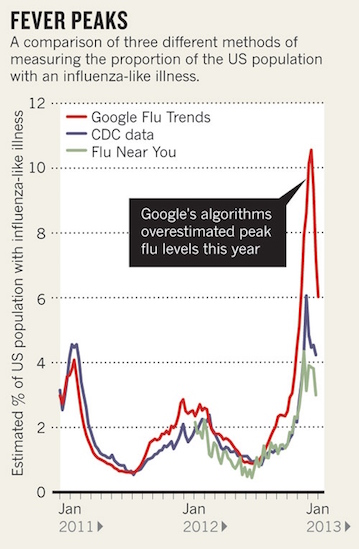

## New survey

https://sebastianbarfort.typeform.com/to/ByHkQG

## Today

Logit example

Supervised Learning 

- test/training data
- regularization (Ridge/Lasso)
- cross validation

Next time

- classification
- decision trees
- unsupervised learning 

## Example: predicting gender from weight/height

Remember this?

```{r, echo = FALSE ,message = FALSE, warning = FALSE}
library("readr")
library("dplyr")
library("ggplot2")
df = read_csv("https://raw.githubusercontent.com/johnmyleswhite/ML_for_Hackers/master/02-Exploration/data/01_heights_weights_genders.csv")
df = df %>% mutate(gender = ifelse(Gender == "Male", 1, 0))
logit.model = glm(gender ~  Height + Weight, data = df, family = binomial(link = "logit"))
ggplot(df, aes(x = Height, y = Weight)) + geom_point(aes(colour = Gender), alpha = .3) +
  geom_abline(intercept = - coef(logit.model)[1] / coef(logit.model)[2],
              slope = - coef(logit.model)[2] / coef(logit.model)[3],
              color = "black")
```

**Exercise**: How did I calculate the line? 

# Supervised Learning

## Introduction

**supervised learning**: Models designed to infer a relationship from *labeled* training data.

**labelled data**: For each observation of the predictor variables, $x_i, 1,..., n$ there is an associated response measurement $y_i$

- When the response measurement is discrete: classifiation
- when the response is continuous: regression 


## Error

Statistical learning models are designed to minimize out of sample error: the error rate you get on a new data set

Key ideas

- Out of sample error is what you care about
- In sample error < out of sample error
- The reason is overfitting (matching your algorithm to the data you have)

## Out of sample error (continuous variables)

Mean squared error (MSE):

$$\frac{1}{n} \sum_{i=1}^{n} (\text{prediction}_i - \text{truth}_i)^2$$

Root mean squared error

$$\sqrt{\frac{1}{n} \sum_{i=1}^{n} (\text{prediction}_i - \text{truth}_i)^2}$$

**Question:** what is the difference?

## Example: predicting age of death

```{r}
library("readr")
df = read_csv("https://raw.githubusercontent.com/johnmyleswhite/ML_for_Hackers/master/05-Regression/data/longevity.csv")
head(df)
```

## 

```{r}
library("dplyr")
df %>% group_by(Smokes) %>% 
  summarise(mean.death = mean(AgeAtDeath))
```

## 

Let's look at MSE for different guesses of age of death

```{r}
guess.accuracy = data.frame()
for (guess in 63:83){
  prediction.error = mean((df$AgeAtDeath - guess)^2)
  guess.accuracy = rbind(guess.accuracy, 
                         data.frame(Guess = guess,
                                    Error = prediction.error))
}
head(guess.accuracy)
```

## 

```{r}
library("ggplot2")
ggplot(guess.accuracy, aes(x = Guess, y = Error)) +
  geom_point() + geom_line() + theme_minimal()
```


## Out of sample error (discrete variables)

One simple way to assess model accuracy when you have discrete outcomes (republican/democrat, professor/student, etc) could be the mean classification error

$$\text{Ave}(I(y_0 \neq \hat{y}_0))$$

But assessing model accuracy with discrete outcomes is often not straightforward. 

You might also want to check out ROC curves

## Test and training data 

Accuracy on the training set (resubstitution accuracy) is optimistic

A better estimate comes from an independent set (test set accuracy)

But we can't use the test set when building the model or it becomes part of the training set

So we estimate the test set accuracy with the training set 

Remember the bias-variance tradeoff

## Example

We now simulate some data to illustrate the difference between test and training data accuracy

```{r}
set.seed(1)
x = seq(0, 1, by = .01)
y = sin(2 * pi * x) + rnorm(length(x), 0, .1)
df = data.frame(x = x, y = y)
```

This is a sine wave with some noise 

##

```{r}
ggplot(data = df, aes(x = x, y = y)) + geom_line() + theme_minimal()
```

## Test & training data

We now split the data into a test and training data set

```{r}
n = length(x)
indices = sort(sample(1:n, round(.5*n)))

training.df = df[indices, ]
test.df = df[-indices, ]
```

## 

Define a RMSE function

```{r}
rmse = function(prediction, truth){
  return(sqrt(mean( (prediction - truth) ^2)))
}
```

## 

We want to get the best polynomial fit for the data. We achieve this by looping over a set of polynomials 

```{r}
performance = data.frame()

for (d in 1:12){
  poly.fit = lm(y ~ poly(x, degree = d), data = training.df)
  performance = rbind(performance, 
                      data.frame(degree = d,
                                 data = "training",
                                 RMSE = rmse(prediction = predict(poly.fit), truth = training.df$y)))
  performance = rbind(performance,
                       data.frame(degree = d, 
                                  data = "test",
                                  RMSE = rmse(prediction = predict(poly.fit, newdata = test.df),
                                              truth = test.df$y)))
}
head(performance)
```

##

```{r}
ggplot(performance, aes(x = degree, y = RMSE, colour = data)) + geom_point() +
  geom_line() + theme_minimal()
```

**Question**: what happens here?

## 

```{r}
for (d in 1:12){
  poly.fit = lm(y ~ poly(x, degree = d), data = training.df)
  training.df = cbind(training.df, predict(poly.fit))
  test.df = cbind(test.df, predict(poly.fit, newdata = test.df))
}
names(training.df) = c("x", "y", paste("degree:", 1:12, sep = " "))
names(test.df) = c("x", "y", paste("degree:", 1:12, sep = " "))

library("tidyr")
training.df = training.df %>% gather(degree, prediction, -x, -y)
test.df = test.df %>% gather(degree, prediction, -x, -y)
```

## Training data

```{r}
p = ggplot(training.df) + geom_point(aes(x = x, y = y), alpha = .3)  + 
  geom_line(aes(x = x, y = prediction), colour = "red") +
  facet_wrap(~ degree) + theme_minimal()
```

## 

```{r, echo = FALSE}
p
```

## Test data

```{r, fig.width = 8, fig.height = 6}
p = ggplot(test.df) + geom_point(aes(x = x, y = y), alpha = .3)  + 
  geom_line(aes(x = x, y = prediction), colour = "red") +
  facet_wrap(~ degree) + theme_minimal()
```

## 

```{r, echo = FALSE}
p
```

## Regularization

The problem with overfitting comes from our model being too complex

Complexity: models are complex when the number or size of the coefficients is large

One approach: punish the model for doing this

This approach is called **regularization**

## Ridge and Lasso regression

Two popular models build on this approach: Ridge and Lasso

The approach is similar: include a **loss function** in the OLS minimization problem to prevent overfitting

$$\sum_{i = 1}^{n}(y_i - \beta_0 - \sum_{j = 1}^{p} b_j x_{ij})^2 + \text{LOSS}$$

- Ridge uses the L2 norm: $\alpha \sum_{j = 1}^{p} \beta_{j}^{2}$
- Lasso uses the L1 norm: $\alpha \sum_{j = 1}^{p} |\beta_{j}|$

This turns out to be very important 

## 


L1 regularization gives you sparse estimates (and therefore performs some form of variable selection)

## Back to our example...

We can examine our L1 and L2 norms as follows

```{r}
lm.fit = lm(y ~ x, data = df)
l2.norm = sum(coef(lm.fit)^2)
l1.norm = sum(abs(coef(lm.fit)))
print(paste0("l2.norm is ", l2.norm))
print(paste0("l1.norm is ", l1.norm))
```

## Fitting the Lasso

Regularization methods are implemented in R in the `glmnet` package (although it might also be worth checking out the newer `caret` package)

```{r, message = FALSE, warning = FALSE}
library("glmnet")
args(glmnet)
```

`alpha` controls the norm. `alpha = 1` is the Lasso penalty, `lasso = 0` is Ridge

##

Let's fit a Lasso model on our sinus wave data

```{r}
library("glmnet")
x = as.matrix(cbind(x,rev(x)))
glmnet(x, y)
```

## `glmnet` output

The output contains three columns

- `Df`: tells you how many coefficients in the model ended up being nonzero
- `%Dev`: essentially a R2 for the model
- `Lambda`: the loss parameter

Because `Lambda` controls the values that we get from the model, it is often referred to as a *hyperparameter*

Large `Lambda`: heavy penalty for model complexity 

## Picking `Lambda`

`Lambda` should be picked by the data! That is, which `Lambda` minimizes RMSE in our test data 

```{r}
library('glmnet')
training.df = df[indices, ]
test.df = df[-indices, ]
glmnet.fit = glmnet(poly(training.df$x, degree = 10), training.df$y) 
lambdas = glmnet.fit$lambda
performance = data.frame()
for (lambda in lambdas){
  performance = rbind(performance,
                      data.frame(lambda = lambda,
                                 RMSE = rmse(prediction = predict(glmnet.fit, poly(test.df$x, degree = 10),
                                                                  s = lambda),
                                             truth = test.df$y)))
}
```

## 

A lambda of 0.05 seems about right...

```{r, echo = FALSE}
ggplot(performance, aes( x = lambda, y = RMSE)) + geom_point() + geom_line() + theme_minimal()
```

## 

```{r}
best.lambda = performance$lambda[performance$RMSE == min(performance$RMSE)]
glmnet.fit = glmnet(poly(df$x, degree = 10), df$y)
coef(glmnet.fit, s = best.lambda)
```

## Regularization conclusion

Note that the model ends up using only 3 nonzero coefficients even though the model has the ability to use 10

Selecting a simpler model when more complicated models are possible is exactly the point of regularization

## Cross Validation

So far we have just randomly dvidided our data into test and training

This approach has two drawbacks

1. the estimate of the RMSE on the test data can be highly variable, depending on precisely which observations are included in the test and training sets
2. in this approach, only the training data is used to fit the model. Since statistical models generally perform worse when trained on fewer observations, this suggests that the RMSE on the test data may actually be too large

One very useful refinement of the test-training data approach is **cross-validation**

## k-fold Cross Validation

The idea behind $k$-fold Cross Validation is relatively simple

1. Divide the data into $k$ roughly equal subsets and label them $s = 1, ..., k$. 
2. Fit your model using the $k-1$ subsets other than subset $s$ 
3. Predict for subset $s$ and calculate RMSE
4. Stop if $s = k$, otherwise increment $s$ by $1$ and continue

The $k$ fold CV estimate is computed by averaging the mean squared errors ($\text{MSE}_1, ..., \text{MSE}_k$)

$$\text{CV}_k = \frac{1}{k}\sum_{i = 1}^{k} \text{MSE}_i$$

Common choices for $k$ are 10 and 5. 

CV can (and should) be used both to find tuning parameters and to report goodness-of-fit measures. 

## 


## Prediction is fun


## But be careful


## 




        