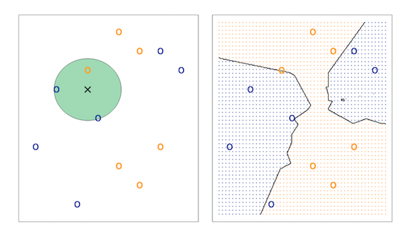
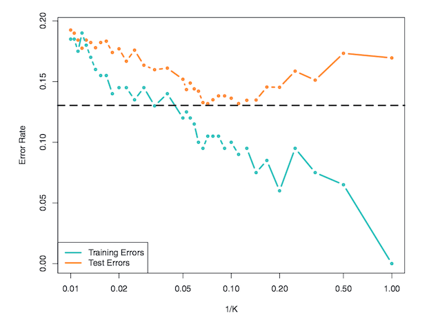
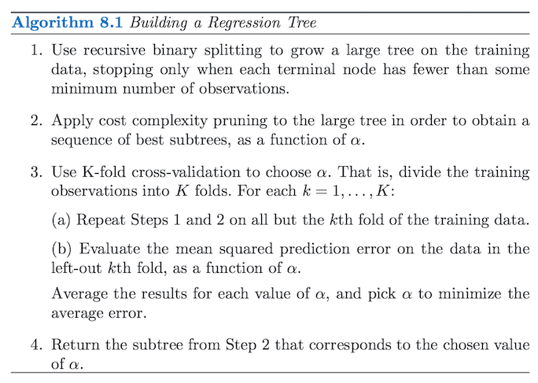
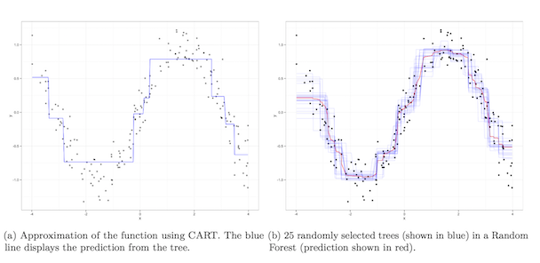

## Today

- new later exam date 
- KNN
- Classification and Regression Tree (CART)
- unsupervised learning 

## Classification

When we are trying to predict discrete outcomes we are effictively doing classification

We saw last time that the logit model could be used for predictions

Today I want to show you an alternative approach: KNN

## K Nearest Neighbors 

KNN attempts to estimate the conditional distribution of $Y$ given $X$, and then classify a given observation to the class with the highest estimated probability. 

Specifically, given a positive integer $K$ and a test observation $x_0$, KNN identifies the $K$ points in the training data that are closest to $x_0$, represented by $N_0$. 

It then estimates the conditional probability for class $j$ as the fraction of points in $N_0$ whose response values equal $j$:

$$Pr(Y = j|X = x_0) = \frac{1}{K} \sum_{i \in N_0} I(y_i = j)$$

and predicts based on majority vote

**Question:** What is the prediction when K = N?

## 



## Choosing k 

The  choice  of $k$ or  the  number  of  neighbors  to  be  included in  the classification  at a new  point  is  important.

A  common  choice  is  to  take $k = 1$ but  this  can  give  rise to  very  irregular  and  jagged  regions  with  high  variances  in prediction.

Larger choices of $k$ lead to smoother regions and less variable classifications, but do not capture local details and can have larger biases.

Cross-validate! 

## 




## Curse of dimensionality

Distance is often Euclidean distance 

kNN breaks down in high-dimensional space

This is because the "neighborhood" becomes very large

This is often called the curse of dimensionality. 


## Classification and Regression Trees (CART)

Decision trees can be applied to both regression and classification problems

They are intuitive, but run the danger of overfitting (what happens if you grow the largest possible decision tree for a given problem?)

Therefore, people usually use extensions such as random forests

## 



## Advantages of tree based methods

Easy to explain 

Mimics the mental model we often use to make decisions

Can easily be displayed graphically

Main disadvantage:

Performance


## CART example: Classifying cuisine given ingredients 

```{r}
library("jsonlite")
food = fromJSON("~/git/sds/data/food.json")
head(food)
```

```{r, echo = FALSE}
food$ingredients = lapply(food$ingredients, FUN=tolower)
food$ingredients = lapply(food$ingredients, FUN=function(x) gsub("-", "_", x))  
food$ingredients = lapply(food$ingredients, FUN=function(x) gsub("[^a-z0-9_ ]", "", x))
```

## Good thing we had Zoltan here last week...

```{r, message = FALSE, warning = FALSE}
library("tm")
combi_ingredients = c(Corpus(VectorSource(food$ingredients)), Corpus(VectorSource(food$ingredients)))
combi_ingredients = tm_map(combi_ingredients, stemDocument, language="english")
combi_ingredientsDTM = DocumentTermMatrix(combi_ingredients)
combi_ingredientsDTM = removeSparseTerms(combi_ingredientsDTM, 0.99)
combi_ingredientsDTM = as.data.frame(as.matrix(combi_ingredientsDTM))
combi = combi_ingredientsDTM
combi_ingredientsDTM$cuisine = as.factor(c(food$cuisine, rep("italian", nrow(food))))
```

## Our food data

```{r}
names(combi_ingredientsDTM)[1:15]
```

```{r}
trainDTM  = combi_ingredientsDTM[1:nrow(food), ]
testDTM = combi_ingredientsDTM[-(1:nrow(food)), ]
```

## Estimate the model

```{r}
library("rpart")
set.seed(1)
model = rpart(cuisine ~ ., data = trainDTM, method = "class")
cuisine = predict(model, newdata = testDTM, type = "class")
summary(model)
```

## Does the tree pass the smell test?

```{r}
library("rpart.plot")
prp(model)
```

## Random forests

Random Forest algoriths are so-called ensemble models

This means that the model consists of many smaller models

The sub-models for Random Forests are classification and regression trees

## Bagging

Breiman (1996) proposed bootstrap aggregating – “bagging” – to to reduce the risk of overfitting. 

The core idea of bagging is to decrease the variance of the predictions of one model, by fitting several models and averaging over their predictions

In order to obtain a variety of models that are not overfit to the available data, each component model is fit only to a bootstrap sample of the data

## Random forest intution

Random forests extended the logic of bagging to predictors. 

This means that, instead of choosing the split from among all the explanatory variables at each node in each tree, only a random subset of the explanatory variables are used

If there are some very important variables they might overshadow the effect of weaker predictors because the algorithm searches for the split that results in the largest reduction in the loss function. 

If at each split only a subset of predictors are available to be chosen, weaker predictors get a chance to be selected more often, reducing the risk of overlooking such variables

## 



Jones & Linder. 2015. [Exploratory Data Analysis using Random Forests](http://zmjones.com/static/papers/rfss_manuscript.pdf).

# Unsupervised Learning 

## Supervised vs unsupervised

**Supervised**

- You have an outcome Y and some covariates X

**Unsupervised**

- You have a bunch of observations X and you want to understand the relationships between them.
- You are usually trying to understand patterns in X or group the variables in X in some way

## Examples of unsupervised learning 

Principal Components Analysis

Clustering


## Principal Components Analysis

You have a set of multivariate variables $X_1,...,X_p$

- Find a new set of multivariate variables that are uncorrelated and explain as much variance as possible.
- If you put all the variables together in one matrix, find the best matrix created with fewer variables (lower rank) that explains the original data.

The first goal is statistical and the second goal is data compression.


##


## Example: Building a market index

```{r,warning=FALSE, message = FALSE}
library("readr")

df = read_csv("https://raw.githubusercontent.com/johnmyleswhite/ML_for_Hackers/master/08-PCA/data/stock_prices.csv")
head(df)
```

##

```{r, echo = FALSE, warning=FALSE, message = FALSE}
library("ggplot2")
p = ggplot(df, aes(x = Date, y = Close))
p + geom_point() + facet_wrap(~ Stock) +
  geom_smooth() +
  theme_minimal()
```

## Market index

Idea: Let's reduce the 25 stocks to 1 dimension and let's call that our *market index*

Dimensionality reduction: shrink a large number of correlated variables into a smaller number

Can be used in many different situations: when we have too many variables for OLS, for unsupervised learning, etc. 

##

```{r, message = FALSE, warning = FALSE}
library("tidyr")
df.wide = df %>% spread(Stock, Close)
df.wide = df.wide[complete.cases(df.wide), ]
head(df.wide)
```

## PCA

```{r, message = FALSE, warning = FALSE}
library("dplyr")
pca = princomp(select(df.wide, -Date))
summary(pca)
```

## Creating market index

```{r}
market.index = predict(pca)[, 1]
market.index = data.frame(market.index = market.index, Date = df.wide$Date)
```

**Question**: How do we validate our index? 

One suggestion: we can compare it to Dow Jones

##

```{r}
library("lubridate")
dj = read_csv("https://raw.githubusercontent.com/johnmyleswhite/ML_for_Hackers/master/08-PCA/data/DJI.csv")
dj = dj %>% filter(ymd(Date) > ymd('2001-12-31')) %>% 
  filter(ymd(Date) != ymd('2002-02-01')) %>% select(Date, Close)
market.data = inner_join(market.index, dj)

head(market.data)
```

## 

```{r, echo = FALSE}
p = ggplot(market.data, aes(x = market.index * (-1), y = Close))
p + geom_point() + geom_smooth(method = "lm") +
  theme_minimal()
```

## 

```{r, warning = FALSE}
market.data = market.data %>% 
  mutate(
    market.index = scale(market.index * (-1)),
    Close = scale(Close)
  )
market.data = market.data %>% gather(index, value, -Date)
head(market.data)
```

## 

```{r, echo = FALSE}
p = ggplot(market.data, aes(x = Date, y = value, group = index, colour = index))
p + geom_line()  + theme_minimal()
```

## Clustering

An alternative approach to unsupervised learning is clustering

In the following we will use MDS - Multidirectional Scaling - to study polarization of politicians in the U.S Congress

## MDS

MDS is a set of statistical techniques used to visually depict the similarities and differences from a set of distances

The model takes a distance matrix that specifies the (usually Euclidean) distance between every pair of points in our data and returns a set of coordinates for those two points that approximates those distances

It is implemented in base R in the `cmdscale` function


## Ideology in the U.S Congress

```{r}
data.dir = "~/git/sds/data"
files = list.files(data.dir, pattern =".dta")

library("foreign")
rollcall.data = lapply(files,
    function(f){read.dta(file.path(data.dir, f), convert.factors = FALSE)})
```

## Cleaning...

```{r}
rollcall.simplified = function(df){
  no.pres = subset(df, state < 99)
  for(i in 10:ncol(no.pres)){
    no.pres[,i] = ifelse(no.pres[,i] > 6, 0, no.pres[,i])
    no.pres[,i] = ifelse(no.pres[,i] > 0 & no.pres[,i] < 4, 1, no.pres[,i])
    no.pres[,i] = ifelse(no.pres[,i] > 1, -1, no.pres[,i])
  }
  return(as.matrix(no.pres[,10:ncol(no.pres)]))
}

rollcall.simple = lapply(rollcall.data, rollcall.simplified)
```

## 

```{r}
dim(rollcall.simple[[1]])
head(rollcall.simple[[1]])
```

## 

```{r}
rollcall.dist = lapply(rollcall.simple, function(x) dist(x %*% t(x)))
rollcall.mds = lapply(rollcall.dist,
                       function(d) as.data.frame((cmdscale(d, k = 2)) * -1))

congresses = 101:111

for(i in 1:length(rollcall.mds))
{
  names(rollcall.mds[[i]]) = c("x", "y")
  
  congress = subset(rollcall.data[[i]], state < 99)
  
  congress.names = sapply(as.character(congress$name),
                           function(n) strsplit(n, "[, ]")[[1]][1])
  
  rollcall.mds[[i]] = transform(rollcall.mds[[i]],
                                 name = congress.names,
                                 party = as.factor(congress$party),
                                 congress = congresses[i])
}

head(rollcall.mds[[1]])
```

##

```{r, echo = FALSE}
df = plyr::ldply(rollcall.mds)
p = ggplot(df, aes(x = x, y = y))
p + geom_point(aes(colour = party)) + 
  facet_wrap(~ congress) + 
  theme_minimal()
```
        