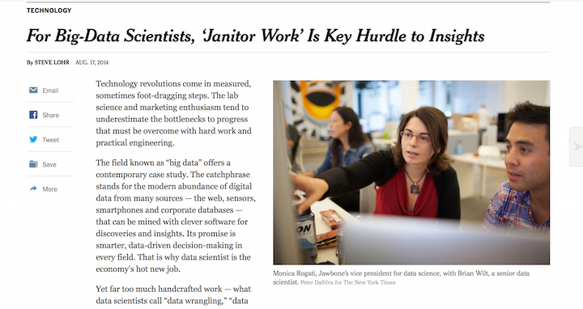
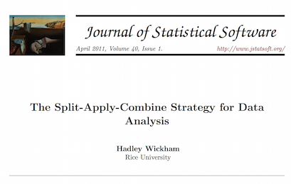
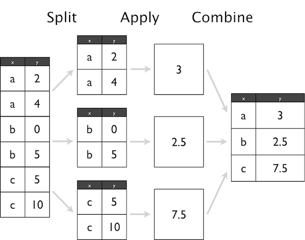

## Today

New survey

Guldølsopgave

New deadline for assignment 1

Data manipulation tools

- split-apply-combine approach to data manipulation
- tidy data 
  
## New survey

Please spend the next 3 minutes completing our second survey

<div class="centered">
https://sebastianbarfort.typeform.com/to/Mo1G6e
</div>


## Optional guldølsopgave 

Do you the chance to win one of these?! 

<div class="centered">

</div>

Then the non-mandatory part of Assignment 1 is for you! 

## Non-mandatory assignment 

The newly elected Danish government has proposed a federal budget for 2016

This is a great data visualization exercise

The assignment is not mandatory, so only do it if you're interested (but remember the incentives!)

Deadline the same as Assignment 1: October 14 

## One attempt...

Here's how Berlingske solved it - can you do better?

<iframe src = 'http://www.b.dk/nationalt/grafisk-se-finansloven-i-hovedtraek' height='1px'></iframe>

## What I want you to do

Find something interesting in the budget proposal for 2016

Visualize it

Send the result to me (along with the `R` script and a few lines explaining what you've done)

The best answer wins a Guldøl - and I'll send your visualization to Berlingske

## Data 

Data is available through the Danish Ministry of Finance

... in a horrible format

Data in nice, tidy format available [here](https://raw.githubusercontent.com/sebastianbarfort/sds/gh-pages/data/finanslov_tidy.csv)

Script [here](https://github.com/sebastianbarfort/sds/blob/gh-pages/scripts/tidy_finanslov.R)

# Data Manipulation 

## Intro 

> "Herein lies the dirty secret about most data scientists' work – it's more data munging than deep learning. The best minds of my generation are deleting commas from log files, and that makes me sad. A Ph.D. is a terrible thing to waste."

[source](http://adage.com/article/digitalnext/dear-madison-avenue-set-data-scientists-free/298676/)

## Data janitor

<div class="centered">

</div>

[source](http://www.nytimes.com/2014/08/18/technology/for-big-data-scientists-hurdle-to-insights-is-janitor-work.html)

## Raw versus processed data

**Raw data**  

- the original source of the data
- often hard to use for data analysis
- you should *never* process your original data

**Processed data**

- Data that is ready for analysis

Data manipulation involves going from *raw* to *processed* data. 

This can include merging, subsetting, transforming, etc. 

*All* steps that take you from raw to processed data should be scripted

## Data for today

In this part of the lecture we will work with the federal budget proposal for 2016

```{r, message = FALSE, warning = FALSE}
library("readr")
df = read_csv("https://raw.githubusercontent.com/sebastianbarfort/sds/gh-pages/data/finanslov_tidy.csv")
```

Some nice guy has already cleaned this data for you

## Overview of your data

Useful functions: 

- `str`: displays the structure of your data frame
- `head`: displays the first rows
- `summary`: gives summary statistics
- `glimpse` (from the `dplyr` package): modern alternative to `str`

## `str`

```{r, message = FALSE, warning = FALSE}
str(df)
```

## `head`

```{r, message = FALSE, warning = FALSE}
head(df)
```


## `summary`

```{r, message = FALSE, warning = FALSE}
summary(df)
```

## `glimpse`

```{r, message = FALSE, warning = FALSE}
library("dplyr")
glimpse(df)
```

## The Split-Apply-Combine approach 

Many data analysis problems involve the application of a *split-apply-combine strategy*, where you break up a big problem into manageable pieces, opereate on each piece independetly and then put the pieces back together

<div class="centered">

</div>

## Split-Apply-Combine

<div class="centered">

</div>


## The `dplyr` package

`dplyr`: (efficiently) split-apply-combine for data frames

**Verbs**

- `filter`: select rows
- `arrange`: order rows
- `select`: select columns
- `rename`: rename columns
- `distinct`: find distinct rows
- `mutate`: add new variables
- `summarise`: summarize across a data set
- `sample_n`: sample from a data set 

## 

## Links

http://jtleek.com/advdatasci/lecture_notes/tidyingdata/#16

https://stat545-ubc.github.io/block009_dplyr-intro.html


