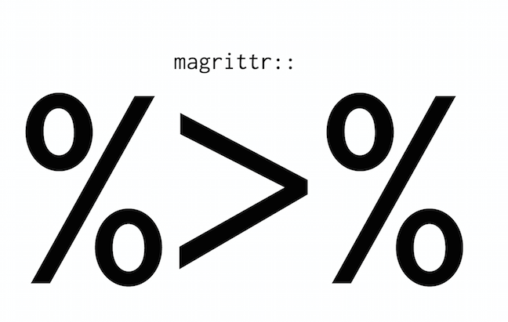
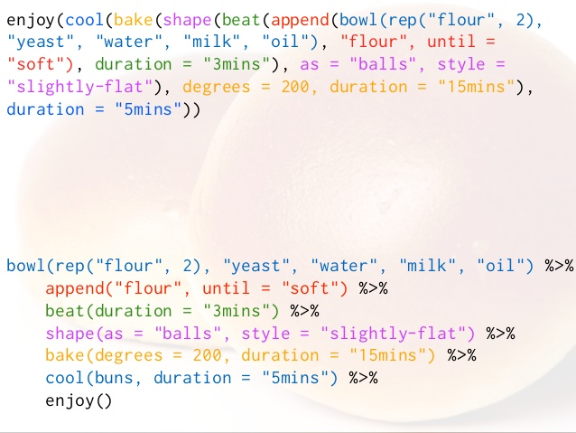
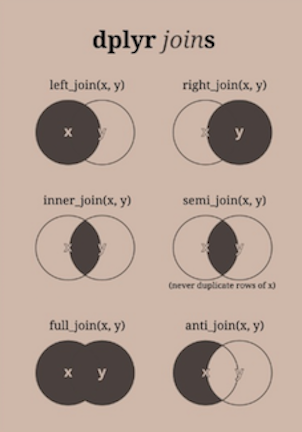

## Today

New survey

Guldølsopgave

New deadline for assignment 1

Data manipulation tools

- split-apply-combine approach to data manipulation
- tidy data 
  
## New survey

Please spend the next 3 minutes completing our second survey

<div class="centered">
https://sebastianbarfort.typeform.com/to/Mo1G6e
</div>


## Optional guldølsopgave 

Do you the chance to win one of these?! 

<div class="centered">

</div>

Then the non-mandatory part of Assignment 1 is for you! 

## Non-mandatory assignment 

The newly elected Danish government has proposed a federal budget for 2016

This is a great data visualization exercise

The assignment is not mandatory, so only do it if you're interested (but remember the incentives!)

Deadline the same as Assignment 1: October 14 

## One attempt...

Here's how Berlingske solved it - can you do better?

<iframe src = 'http://www.b.dk/nationalt/grafisk-se-finansloven-i-hovedtraek' height='1px'></iframe>

## What I want you to do

Find something interesting in the budget proposal for 2016

Visualize it

Send the result to me (along with the `R` script and a few lines explaining what you've done)

The best answer wins a Guldøl - and I'll send your visualization to Berlingske

## Data 

Data is available through the Danish Ministry of Finance

... in a horrible format

Data in nice, tidy format available [here](https://raw.githubusercontent.com/sebastianbarfort/sds/gh-pages/data/finanslov_tidy.csv)

Script [here](https://github.com/sebastianbarfort/sds/blob/gh-pages/scripts/tidy_finanslov.R)

# Data Manipulation 

## Intro 

> "Herein lies the dirty secret about most data scientists' work – it's more data munging than deep learning. The best minds of my generation are deleting commas from log files, and that makes me sad. A Ph.D. is a terrible thing to waste."

[source](http://adage.com/article/digitalnext/dear-madison-avenue-set-data-scientists-free/298676/)

## Data janitor

<div class="centered">

</div>

[source](http://www.nytimes.com/2014/08/18/technology/for-big-data-scientists-hurdle-to-insights-is-janitor-work.html)

## Raw versus processed data

**Raw data**  

- the original source of the data
- often hard to use for data analysis
- you should *never* process your original data

**Processed data**

- Data that is ready for analysis

Data manipulation involves going from *raw* to *processed* data. 

This can include merging, subsetting, transforming, etc. 

*All* steps that take you from raw to processed data should be scripted

## Data for today

In this part of the lecture we will work with the federal budget proposal for 2016

```{r, message = FALSE, warning = FALSE}
library("readr")
df = read_csv("https://raw.githubusercontent.com/sebastianbarfort/sds/gh-pages/data/finanslov_tidy.csv")
```

Some nice guy has already cleaned this data for you

## Overview of your data

Useful functions: 

- `str`: displays the structure of your data frame
- `head`: displays the first rows
- `summary`: gives summary statistics
- `glimpse` (from the `dplyr` package): modern alternative to `str`

## `str`

```{r, message = FALSE, warning = FALSE}
str(df)
```

## `head`

```{r, message = FALSE, warning = FALSE}
head(df)
```


## `summary`

```{r, message = FALSE, warning = FALSE}
summary(df)
```

## `glimpse`

```{r, message = FALSE, warning = FALSE}
library("dplyr")
glimpse(df)
```

## The Split-Apply-Combine approach 

Many data analysis problems involve the application of a *split-apply-combine strategy*, where you break up a big problem into manageable pieces, opereate on each piece independetly and then put the pieces back together

<div class="centered">

</div>

## Split-Apply-Combine

<div class="centered">

</div>


## The `dplyr` package

`dplyr`: (efficiently) split-apply-combine for data frames

**Verbs** 
a verb is a function that takes a data frame as it's first argument

- `filter`: select rows
- `arrange`: order rows
- `select`: select columns
- `rename`: rename columns
- `distinct`: find distinct rows
- `mutate`: add new variables
- `summarise`: summarize across a data set
- `sample_n`: sample from a data set 

## The `filter` function I

```{r}
filter(df, udgift == min(udgift))
```

```{r}
filter(df, paragraf == "Skatter og afgifter ")
```

## Combining conditions: `and`

You can easily combine conditions

```{r}
filter(df, paragraf == "Skatter og afgifter " & aktivitet == "Personskatter ")
```

## Combining conditions: `or`

```{r}
filter(df, paragraf == "Skatter og afgifter " | aktivitet == "Personskatter ")
```

## The `select` function

```{r}
select(df, aar, udgift)
```

## The `arrange` function

```{r}
arrange(df, hovedomrode, udgift)
```

## Arrange by numeric variable

```{r}
arrange(df, -aar)
```

## The `mutate` function

`mutate` let's you add new variables to your data frame

```{r}
df.mutated = mutate(df, newVar = udgift/2)
select(df.mutated, newVar, udgift)
```

## The `sample_n` function

```{r}
sample_n(df, 3)
```

## Digression: Meet the pipe

<div class="centered">

</div>

## The pipe operator

The pipe operator `%>%` (RStudio has keyboard shortcuts, learn to use them!) let's you write sequences instead of nested functions

`x %>% f(y)` -> `f(x,y)`
    
`x %>% f(z, .)` -> `f(z, x)`

Read `%>%` as "then". First do this, *then* do this, etc...

It's implemented in `R` by a [Danish econometrician](https://twitter.com/stefanbache)

## Intuition 

<div class="centered">

</div>

[source](http://www.slideshare.net/romainfrancois)

## Combining `dplyr` and the pipe

`dplyr` is designed to work with the pipe.

So 

```{r, eval = FALSE}
df %>% 
  select(aar, udgift) %>% 
  filter(aar == 2014)
```

returns the same as

```{r, eval = FALSE}
filter(select(df, aar, udgift), aar == 2014)
```

## Example

Show me a random sample of the data from 2014, where `paragraf == Folketinget` and `udgift` is above the mean.

```{r}
df.1 = filter(df, aar == 2014 & paragraf == "Folketinget ")
df.2 = filter(df.1, udgift > mean(udgift, na.rm = TRUE))
df.3 = sample_n(df.2, 3)
df.3
```

## With the pipe

```{r}
df %>% 
  filter(aar == 2014 & paragraf == "Folketinget ") %>% 
  filter(udgift > mean(udgift, na.rm = TRUE)) %>% 
  sample_n(3)
```

Note how readable the code is. Almost like a grammer of data manipulation?

## Grouped operations

So far, we have primarily learned how to manipulate data frames. 

The `dplyr` package becomes really powerful when we introduce the `group_by` function

`group_by` breaks down a dataset into specified groups of rows. When you then apply the verbs above on the resulting object they’ll be automatically applied "by group".

Use in conjunction with `mutate` (to add existing rows to your data frame) or `summarise` (to create a new data frame)

## Common `mutate`/`summarise` options

- `mean`: mean within groups
- `sum`: sum within groups
- `sd`: standard deviation within groups
- `max`: max within groups
- `n()`: number in each group
- `first`: first in group
- `last`: last in group
- `nth(n = 3)`: nth in group (3rd here)

## `group_by` in action I

Which ministry has the largest expenses?

```{r}
df %>% filter(udgift >= 0) %>% group_by(paragraf) %>% 
  summarise(totale.udgifter = sum(udgift, na.rm = TRUE)) %>% 
  arrange(-totale.udgifter)
```

## `group_by` in action II

Add `totale.udgifter` to the existing data frame

```{r}
df %>% filter(udgift >= 0) %>% group_by(paragraf) %>% 
  mutate(totale.udgifter = sum(udgift, na.rm = TRUE)) %>% 
  select(aar, udgift, totale.udgifter)
```

## `group_by` in action III

You can group by several variables

```{r}
df %>% filter(udgift >= 0) %>% group_by(aar, paragraf) %>% 
  summarise(totale.udgifter = sum(udgift, na.rm = TRUE)) %>% 
  arrange(-totale.udgifter)
```

## `group_by` in action IV

You can group by several variables

```{r}
df %>% filter(udgift >= 0) %>% group_by(paragraf, hovedomrode) %>% 
  summarise(totale.udgifter = sum(udgift, na.rm = TRUE)) %>% 
  arrange(-totale.udgifter)
```

## Merging data sets

Merging two data sets can be tricky and depends on your needs. It's important to think about what you want before joining. 

<div class="centered">

</div>

## Superhero example

https://stat545-ubc.github.io/bit001_dplyr-cheatsheet.html

```{r}
superheroes = c("    name, alignment, gender,         publisher",
    " Magneto,       bad,   male,            Marvel",
    "   Storm,      good, female,            Marvel",
    "Mystique,       bad, female,            Marvel",
    "  Batman,      good,   male,                DC",
    "   Joker,       bad,   male,                DC",
    "Catwoman,       bad, female,                DC",
    " Hellboy,      good,   male, Dark Horse Comics")

superheroes = read.csv(text = superheroes, strip.white = TRUE)
head(superheroes)
```

## Publishers

```{r}
publishers = c("publisher, yr_founded",
    "       DC,       1934",
    "   Marvel,       1939",
    "    Image,       1992")
publishers = read.csv(text = publishers, strip.white = TRUE)
head(publishers)
```

## Inner join

```{r}
ijsp = inner_join(superheroes, publishers)
ijsp
```

## Left join

```{r}
ljsp = left_join(superheroes, publishers)
ljsp
```

## Merging different names

```{r}
superheroes = mutate(superheroes,
                seblikes = (publisher=="Marvel"))
publishers = mutate(publishers,
                    seb = (publisher == "Marvel"))
ij2 = inner_join(superheroes,publishers)
ij2
```

## Merging different names

```{r}
ij2 = inner_join(superheroes,publishers,
                    by=c("publisher"="publisher",
                            "seblikes"="seb"))
ij2
```

# Strings

## the `strsplit` function

> Split the elements of a character vector `x` into substrings according to the matches to substring split within them.

```{r}
strsplit(names(df), "t")
```

## the `gsub` function

```{r}
gsub("t", " ", names(df))
```

## the `substr` function

> Extract or replace substrings in a character vector.

```{r}
substr(names(df), 1, 3)
```

## the `grep` function

Regular expression matching

```{r}
grep("t", names(df))
```

```{r}
grepl("t", names(df))
```

## `tolower` and `toupper`

```{r}
tolower(names(df))
```

```{r}
toupper(names(df))
```

## The `stringr` package

```{r}
library("stringr")
str_detect(names(df), "t")
```

```{r}
str_subset(names(df), "t")
```

## Useful functions

```{r}
str_trim("Sebastian           ")
paste0("Sebastian", "Barfort")
nchar("SebastianBarfort")
```

## Next

Tidy data 

Regular expressions


